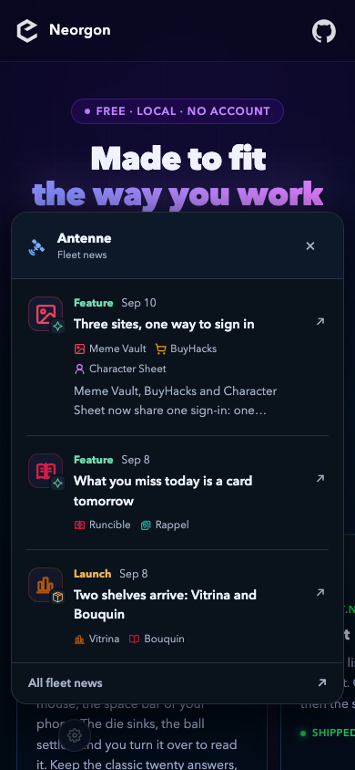
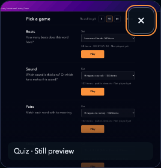
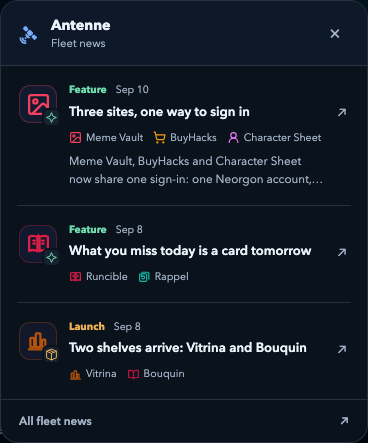

# The visual pass left three usability gaps

**Three priorities, implemented in order**

Neorgon

---

## News is one tap away on phones

---

## Previews work with keys, touch, and reduced motion

---

## Each linked tool has a name and an icon

---

## Both browsers pass the behavior checks
- 56 bulletin assertions in Chromium and WebKit
- 28 preview assertions in each browser
- Repository icon, count and preview checks pass
- Mobile and desktop captures visually inspected

---

## The remaining costs are explicit
- Still previews currently download the source GIF
- Unrecognized story kinds need renderer support
- Existing preview gaps remain
- Manual screen-reader review is still open

---

# Verify the release on the live site

**→ Open neorgon.com**

Try mobile news, a keyboard preview, and multi-tool headlines.
