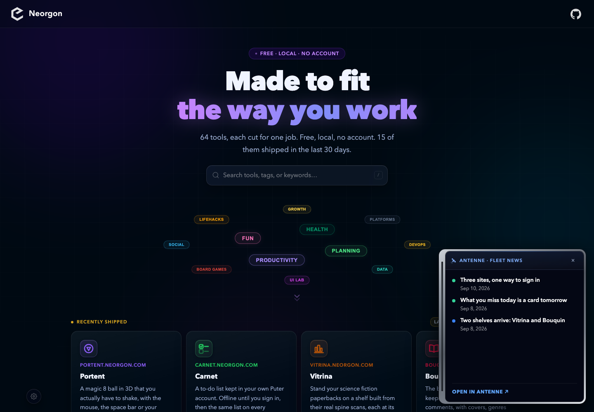
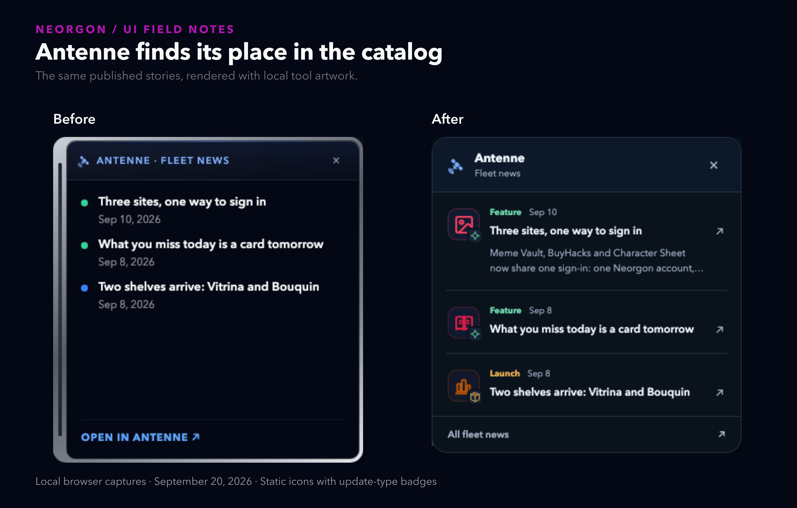
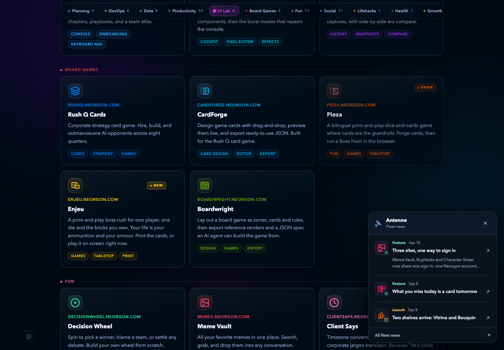

# The news box felt separate from the catalog

**Antenne and catalog polish · GPT-6 Astra session**

Neorgon

---

## The frame was louder than the stories

---

# Use the catalog's own visual language

Local artwork, recognizable update types, quieter framing

---

## Each story now has a recognizable tool

---

## The catalog gains clearer boundaries

---

# A bulletin must behave like part of the page

One feed, native links, keyboard dismissal

---

## The hub now owns the small news view

**Before**
- Fetch the feed, then load an iframe
- Remember only the newest publication date

**After**
- Render three stories from the fetched feed
- Remember story IDs and dates
- Return focus when dismissing

---

## Checks cover failure states as well as appearance
- Repository icon, count and preview checks pass
- Dismiss, reopen and same-day updates verified
- Malformed feeds and unavailable storage exercised
- Long titles and narrow viewports checked

---

## The smaller view has maintenance costs
- New story kinds need a renderer update
- Multi-tool stories show one matching icon
- Legacy dismissals can reopen once

---

## Live deployment remains open
- Production feed and CORS still need a check
- No user study or speed benchmark recorded
- Existing GIF coverage gaps remain

---

# Review the page and the model-review draft

**→ Open the local preview**

Compare the captures, then decide when to publish.
